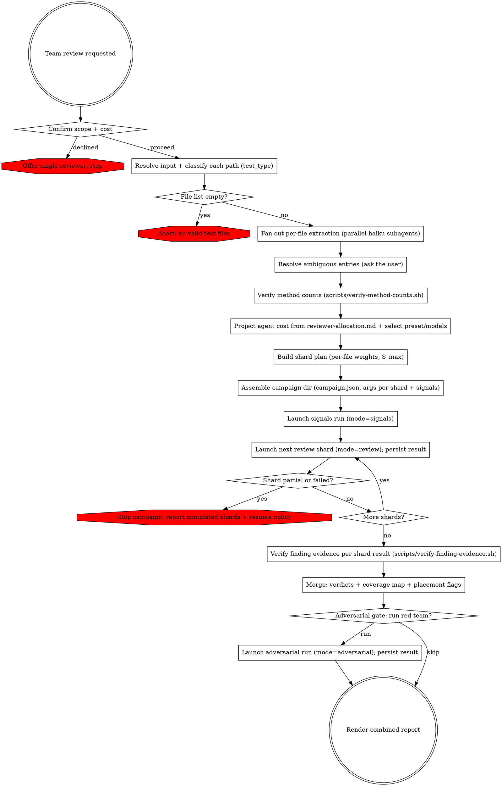

# Team-Based PHPUnit Test Review

Resolve the input into a mixed test-file manifest, project the agent cost, partition the manifest into shards that each fit one Task campaign, and drive the review as sequential Task launches with every stage result persisted to disk: a signals run (cross-file consistency + adoption), the review shards (consensus), a deterministic merge, and a gated adversarial run (red team + defense + arbitration). All stages use the `test-reviewer` and `test-adversary` agents via Cursor `Task`. The review is strictly read-only — it never mutates the tests under review.

Claude Workflows (`Workflow`, `team-review.workflow.mjs`) are gone. Do not search for or author a workflow script.



## Phase 0: Confirm Scope & Cost

This review spawns many parallel agents and consumes substantially more tokens than a single-reviewer pass. Ask whether to proceed with the team review or run a single-reviewer pass with the matching per-type reviewing skill (`phpunit-unit-test-reviewing` for unit, `phpunit-integration-test-reviewing` for integration, `phpunit-migration-test-reviewing` for migration) instead. Proceed only on confirmation. The preset and model combo are chosen later (Phase 2), informed by the projected agent count.

## Phase 1: Resolve Input to a Manifest

`Read` references/input-resolution.md. Resolve the input to a **file list** and classify each path by its root — `tests/unit/` → `test_type=unit`, `tests/integration/` → `integration`, `tests/migration/` → `migration`. Resolve interactive ambiguity that blocks resolution — base branch for a branch diff, unclear scope — by asking the user; the review cannot ask once it is running. If the file list is empty, abort per references/error-handling.md.

Then build each file's entry **in parallel**: spawn one `generalPurpose` Task per file, each running references/input-resolution.md §Per-File Extraction. Inline that contract verbatim into every spawn — a spawned agent never reads the reference. Each subagent measures its file with `wc`/`grep` (never estimates), enumerates every test method, resolves the `#[CoversClass]` source, computes the cross-file `fingerprint` and (when the file's combined lines exceed the digest threshold) the body-free `digest` — or, when the source cannot be resolved to a `src/` file, returns `ambiguous: true` with a reason instead of guessing.

Aggregate the returned entries. For every entry flagged `ambiguous` and refill its fields from the answer — a guessed source size silently flips the track decision, so nothing ambiguous may reach the run. Let N = number of files.

Scripts live at `${CURSOR_PLUGIN_ROOT}/skills/phpunit-test-team-reviewing/scripts/`. If `CURSOR_PLUGIN_ROOT` is unset, `Glob` for `verify-method-counts.sh` under the installed `test-writing` plugin.

Before the manifest freezes, `Write` the aggregated entries to a manifest-core JSON file and run `scripts/verify-method-counts.sh <manifest-core.json> <repo_root>`; replace the manifest with its stdout. A subagent-reported `method_count`/`test_methods` mismatch is corrected to the extracted truth and logged to stderr — never merely a warning (references/input-resolution.md §Per-File Extraction). A missing entry file or invalid manifest JSON fails the script hard; treat it as an input-resolution failure (references/error-handling.md).

Output: a manifest of validated entries, each with `test_type`, method scope (`methods`, plus the diff-touched `changed_methods` on diff runs), the full `test_methods` list, resolved `source_path`/`source_paths`, decomposition measurements (`test_lines`, `source_lines`, `method_count`), `fingerprint`, a `digest` when combined lines exceed the threshold, and `baseline` (`pass`/`fail`/`unavailable`, supplied with the manifest — `unavailable` when not supplied; this skill does not execute tests to obtain it) (references/input-resolution.md).

## Phase 2: Project the Cost, Select the Preset, Build the Shard Plan

Project cost from references/reviewer-allocation.md — do **not** launch a Workflow dry-run. This step spawns **no** review agents.

1. `Read` references/reviewer-allocation.md. Using the Phase-1 entries, compute per-file `units` and `weight = units × SLOTS × 3 + lenses` for each named preset (`deep` / `standard` / `lean`). `SLOTS=3`. Treat this table as the projection (`review_agents_bound`, `adversarial_agents_bound`, `per_file`).
2. Render the projections as a compact table (per preset: units, review bound, adversarial bound).
3. Ask the user to choose preset + model combo, defaulting to `standard` / `sonnet-opus`.
   - **preset** — `deep` / `standard` / `lean`: cost/quality operating point (whole-class coverage threshold, shard granularity, adversary lens count, arbitration caps). Per-preset values: references/reviewer-allocation.md.
   - **models** — `sonnet-opus` / `haiku-opus` / `haiku-sonnet`: body and adversary model tiers. Lower body tiers cut cost but reduce rule-application precision; keep the adversary tier no lower than sonnet.
4. Build the shard plan from the chosen preset's `per_file` weights (references/reviewer-allocation.md §Shard Budget): if the preset's `review_agents_bound` ≤ S_max (250), the plan is one shard; otherwise partition round-robin by descending `weight` into the fewest shards whose per-shard weight sums stay ≤ S_max. A file never straddles shards. Render the plan (shard count, files and projected agents per shard) with the projection table.

## Phase 3: Assemble the Campaign on Disk

Each Task campaign reads its manifest from files on disk. Assemble every stage's manifest as a JSON file inside one campaign directory; the catalogs are large (tens of KB each) by design, so splice them in **by path** and never load them into context.

1. **Campaign directory.** Create it outside the repository — `CAMPAIGN="$(mktemp -d)"`. Every args file and stage result lives here; a later session resumes the campaign from this directory alone.
2. **Per-type rule catalogs.** For each test type present in the manifest, call `build_rule_package` and keep the returned **path** (do not `Read` it). Each call composes that type's catalog — its own rule group plus every convention, design, isolation, and provider rule whose `test-types` declares the type — so never pass `group`, which would narrow the catalog back to one group:
   - unit → `build_rule_package()` (no arguments)
   - integration → `build_rule_package(test_type=integration)`
   - migration → `build_rule_package(test_type=migration)`

   If a needed build fails or reports zero rules, abort (references/error-handling.md).
3. **Per-shard args.** For each shard k, `Write` its Phase-1 entries (plus any `base` ref and the Phase-2 `preset` / `models` names) to `$CAMPAIGN/manifest-core-k.json`, then merge the catalogs in by path with `jq --rawfile` — include only the `rule_packages` keys for types present in that shard:

   ```
   jq -n \
     --slurpfile core "$CAMPAIGN/manifest-core-k.json" \
     --rawfile unit  <unit catalog path> \
     --rawfile integ <integration catalog path> \
     '{ mode: "review", files: $core[0].files, base: $core[0].base,
        preset: $core[0].preset, models: $core[0].models,
        rule_packages: { unit: $unit, integration: $integ } }' \
     > "$CAMPAIGN/args-shard-k.json"
   ```

   Each entry's `baseline` value carries through unchanged as part of `$core[0].files` — no separate wiring.
4. **Signals args.** `Write` `{ "mode": "signals", "files": [<ALL Phase-1 entries>], "base": <base> }` to `$CAMPAIGN/args-signals.json` — the signals run needs no rule catalogs.
5. **Campaign state.** `Write` `$CAMPAIGN/campaign.json`: the base ref, preset/models, and one entry per stage (`signals`, `shard-1..N`, `adversarial`) with its args path and `status: "pending"`.

The manifests are fixed here, before any launch — nothing ambiguous may reach a run.

## Phase 4: Execute the Campaign

Launch each stage with Cursor `Task`. Spawn `test-reviewer` / `test-adversary` (and `generalPurpose` for signals) as specified in references/workflow-design.md and references/agent-guardrails.md. Inline the stage's args JSON path and the relevant skill contracts into each Task prompt. Do not compose a Workflow script.

1. **Launch the signals run first** (it depends on nothing and may run concurrently with the first shard).
2. **Launch review shards strictly one at a time.** Launch shard k; when it completes, `Write` the raw result to `$CAMPAIGN/shard-k.result.json` and set its `campaign.json` status **before** launching shard k+1.
3. **Check every stage result before continuing.** A result with `partial: true`, a failed run, or a launch error stops the campaign: update `campaign.json`, report which stages completed and which did not, and apply the resume policy in references/error-handling.md. Do not launch the next stage into a known-dead quota window.
4. When the signals result arrives, `Write` it to `$CAMPAIGN/signals.result.json`.

## Phase 5: Merge the Consensus & Compute the Deterministic Signals

When all shards completed, merge on disk — no agents:

1. **Verify finding evidence.** For every persisted `$CAMPAIGN/shard-k.result.json`, run `scripts/verify-finding-evidence.sh $CAMPAIGN/shard-k.result.json <repo_root>` and overwrite the file with its stdout. A kept finding whose `current` fails the evidence check is moved into `contested` (tagged with an `outcome` reason) and synced out of that file's `adversarial_input.kept` — so a fabricated quote never reaches this merge, Phase 6's `args-adversarial.json`, or the report as kept. A referenced file missing on disk or an invalid result JSON fails the script hard; treat it as a stage result failure (references/error-handling.md).
2. **Combined verdicts.** Concatenate the (now evidence-checked) shard results' `files` arrays; aggregate `kept_findings`, `contested_findings`, and `concession_rate` (weighted by each shard's `wave0` finding keys) from the shard summaries.
3. **SUT-coverage map.** Join every manifest entry's `source_paths` to its test path; report each SUT covered by ≥ 2 test files as `{ sut, covered_by: [{path, test_type}], note }`, noting `integration test redundant with existing unit coverage of this SUT` when the covering set mixes unit and integration (references/report-format.md §Coverage Map).
4. **Placement flags.** Flag an integration file when (a) its merged result carries an `INTEGRATION-008` informational finding, and/or (b) the coverage map shows it redundant with unit coverage. Each flag points at `phpunit-integration-to-unit-migrating` and never raises status.

Render the consensus-stage report section now (report-format.md) — it survives even if the adversarial stage never runs.

## Phase 6: Adversarial Gate, Run & After-State Guard

The adversarial stage (red team + defense + arbitration) is the expensive part and the only stage that consumes consensus. Gate it explicitly, then check what the final finding set removes:

1. Aggregate the shard summaries' `adversarial_gate` signals. If every shard recommends skip (zero kept findings, or concession ≥ 50%), recommend skipping.
2. Ask the user: kept/contested totals, the skip signals, and the chosen preset's `adversarial_agents_bound` from the Phase-2 projection. Default to run when findings exist and no skip signal fired.
3. On **skip**: the consensus-stage results are final; go to Phase 7.
4. On **run**: assemble `$CAMPAIGN/args-adversarial.json` — `mode: "adversarial"`, ALL files, the same `rule_packages` / `preset` / `models` / `base`, plus `consensus`: the array of every file's `adversarial_input` object extracted from the shard results (`jq`, by path) — Phase 5 already ran `verify-finding-evidence.sh` over these shard results, so a demoted finding is already out of `adversarial_input.kept` before this extraction. Launch via Task, persist to `$CAMPAIGN/adversarial.result.json` with the same stop-on-partial policy as Phase 4.

## Phase 7: Render the Report

`Read` references/report-format.md and render the combined report from the persisted stage results. The stage results carry fields only — every heading, label, and field line comes from that template. Render: per-file verdicts (the adversarial result's `files` supersede the consensus-stage entries for files it processed), the signals result's `consistency` and `adoption_opportunities`, the Phase-5 coverage map and placement flags, and the per-stage cost lines (each stage result's `agents_spawned` and `output_tokens`).

Each file's section states that file entry's `baseline` directly under its `## File: path` heading — `- **Baseline**: pass | fail | unavailable`.

Every finding heading is exactly `#### [RULE-ID] Title`. Consensus, provenance (`adversary_impact`), branch scope (`branch_touched`), arbitration and source-change status are field lines under the heading, never heading suffixes; a finding carrying more than one `suggested_variants` entry renders each under its own numbered `- **Suggested Fix**` entry (report-format.md §Per-finding render conventions).

Every finding also carries a **Scrutiny** field line: `adversary-tested` when its file's findings passed through the adversarial stage's superseding verdicts, `consensus-only` otherwise — derived deterministically from which stage produced the file's final per-finding state, never asserted independently per finding (report-format.md §Per-finding render conventions).

This review has no fix phase — it only reports. For applying a report's remediations, `Read` references/fix-application.md.

## Error Handling

For input-resolution failures, stage start-up or run failures, partial results (`partial: true` + `halted_at`), the campaign stop/resume policy, and consensus edge cases, `Read` references/error-handling.md.
